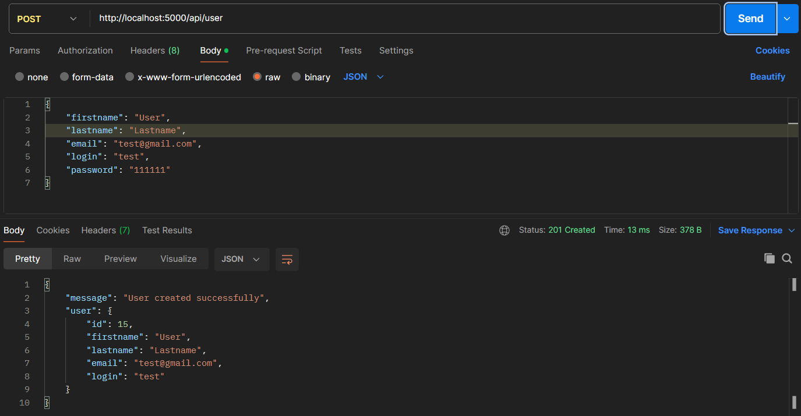
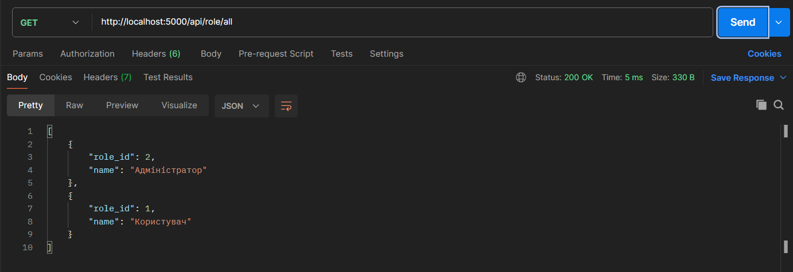

# Тестування працездатності системи

Тестування відбувається за допомогою програми Postman

### Запуск сервера

    

### GET /user/all

    

### GET /user/:id

    

### POST /user

    

### PATCH /user/:id

    

### DELETE /user/:id

    

### GET /role/all

    

### GET /role/:id

    

### POST /role

    

### PATCH /role/:id

    

### DELETE /role/:id

    

### GET with wrong id

    

### POST without required fields

    

### PATCH with wrong id

    

### DELETE with wrong id

    

